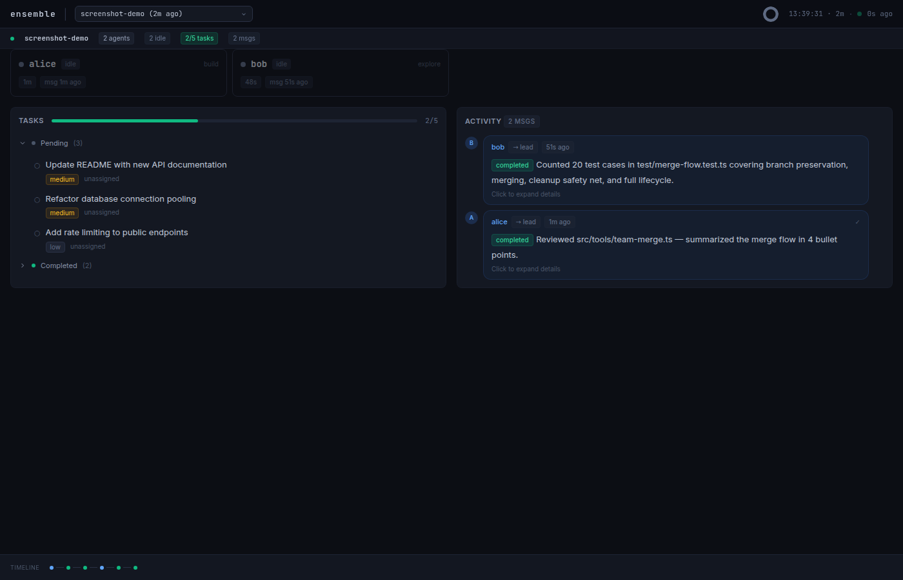

<p align="center">
  
</p>

# OpenCode Ensemble

[](https://www.npmjs.com/package/@hueyexe/opencode-ensemble)
[](https://www.npmjs.com/package/@hueyexe/opencode-ensemble)
[]()
[]()
[]()
[](./LICENSE)

Run parallel AI agents in OpenCode. Each agent gets its own session, context window, and task. They coordinate through messaging and a shared task board.

Plugin built on the public OpenCode SDK. No internal dependencies.

## Quick Start

```json
{
  "plugin": ["@hueyexe/opencode-ensemble@0.16.0"]
}
```

Add to your `opencode.json`, restart OpenCode, and ask it to do something that benefits from parallel work. The agent handles the rest. See [Install](#install) for full setup including worktree permissions.

## What actually happens

You ask the agent to do something complex. It creates a team, spawns teammates, and they work in parallel. Each teammate runs in its own OpenCode session with a fresh context window.

A realistic development-team interaction:

```
You: "Fix checkout idempotency so duplicate Stripe webhooks cannot create
duplicate orders. Add regression tests and review the final diff for risk."

The lead agent:
1. Creates a team called "checkout-idempotency".
2. Adds independent tasks first and records the generated task IDs.
3. Adds dependent QA and review tasks with `depends_on` using real returned IDs.
4. Spawns a small team with explicit roles:
   - scout: explore agent, worktree disabled, model openai/gpt-5.3-codex-spark
   - api-dev: build agent, own worktree, model anthropic/claude-opus-4-7, plan_approval: true
   - qa: build agent, own worktree, model anthropic/claude-sonnet-4-6
   - reviewer: explore agent, worktree disabled, model openai/gpt-5.3-codex-spark
```

The lead uses the task board to make sequencing visible. Record the returned task IDs before creating dependent tasks:

```ts
team_tasks_add({
  tasks: [
    { content: "Map checkout webhook flow and identify idempotency risks", priority: "high" },
    { content: "Implement duplicate-webhook idempotency guard", priority: "high" },
  ],
})
// -> Added 2 tasks: task_abc123, task_def456

team_tasks_add({
  tasks: [
    { content: "Add regression tests for duplicate webhook delivery", priority: "high", depends_on: ["task_def456"] },
  ],
})
// -> Added 1 task: task_ghi789

team_tasks_add({
  tasks: [
    { content: "Review final diff for order, payment, and retry risks", priority: "medium", depends_on: ["task_def456", "task_ghi789"] },
  ],
})
// -> Added 1 task: task_jkl012
```

Then it spawns teammates one at a time:

```ts
team_spawn({
  name: "scout",
  agent: "explore",
  worktree: false,
  model: "openai/gpt-5.3-codex-spark",
  claim_task: "task_abc123",
  prompt: "Trace the checkout webhook flow. Report the files, data model, existing tests, and the smallest safe implementation plan. Do not edit files.",
})

team_spawn({
  name: "api-dev",
  agent: "build",
  model: "anthropic/claude-opus-4-7",
  plan_approval: true,
  claim_task: "task_def456",
  prompt: "After scout reports, implement the idempotency guard. Keep the change narrow. Commit your work and send a task-result message.",
})
```

The same pattern assigns `qa` to regression tests and `reviewer` to final review. The reviewer stays read-only (`worktree: false`) so it can inspect merged changes without producing another branch.

Teammates coordinate without the lead polling:

```
scout -> lead: "Checkout flow is src/webhooks/stripe.ts -> createOrderFromPayment(). Existing tests are in test/checkout-webhook.test.ts. Risk: retries race before order insert commits."
api-dev -> lead: "Plan ready: add unique event_id insert before order creation, treat duplicate insert as success, add a transaction around order creation."
lead -> api-dev: approves plan
qa -> api-dev: "Which duplicate signal should tests assert: event_id conflict or existing order lookup?"
api-dev -> qa: "Assert duplicate event_id returns success and creates one order. See src/webhooks/stripe.ts."
```

When work is done, the lead reviews and integrates deliberately:

```
team_results({ from: "api-dev" })
team_shutdown({ member: "api-dev" })
team_merge({ member: "api-dev" })

team_results({ from: "qa" })
team_shutdown({ member: "qa" })
team_merge({ member: "qa" })

team_spawn({ name: "reviewer", agent: "explore", worktree: false, claim_task: "task_jkl012", prompt: "Review the merged diff for correctness, missed tests, and risky behavior. Do not edit files." })
```

The lead runs the repository verification commands, summarizes the result, and only then cleans up the team. All merged teammate changes remain in your working directory as unstaged changes for review with `git diff`.

## Agent Skill

Install the companion skill to teach your AI how to form useful Ensemble teams, write better teammate prompts, choose models, and avoid common coordination failures:

```bash
npx skills@latest add hueyexe/opencode-ensemble --skill opencode-ensemble
```

The skill is useful when you want the agent to decide whether parallel work is appropriate, split work into independent slices, use `depends_on` correctly, or pick a safe mix of `explore` and `build` teammates.

Good team shapes:

- **Scout, builder, reviewer**: one read-only `explore` agent maps the code, one `build` agent changes it, one read-only `explore` agent reviews the diff.
- **Parallel slices**: two or three `build` agents own independent files or vertical slices, then one reviewer checks the combined result.
- **Risky change**: use `plan_approval: true` on the implementing teammate, then approve or reject the plan through `team_message` before edits begin.

## Dashboard

A real-time mission control dashboard runs at `http://localhost:4747` while OpenCode is active.



- **Health ring** — at-a-glance team health indicator in the header
- **Agent cards** — status, current task, activity sparklines, timing. Click to open detail drawer
- **Agent drawer** — full prompt, model, execution status, chat-style message history with markdown rendering
- **Task board** — progress bar, collapsible status groups, dependency arrows
- **Activity feed** — chat-style message bubbles with avatars, expandable with full markdown
- **Timeline** — horizontal event strip showing spawns, messages, completions, shutdowns
- **Keyboard shortcuts** — `j/k` navigate agents, `Enter` opens drawer, `Esc` closes, `?` shows help
- **Live clock** — current time + team session duration
- **Project outline** — collapsible per-project grouping when teams span multiple working directories

Configure the port in `.opencode/ensemble.json`:

```json
{
  "dashboardPort": 4747
}
```

Set to `0` to disable. The dashboard starts automatically when OpenCode loads the plugin.

## Install

Two steps: add the plugin, then allowlist worktree paths.

### Runtime requirements

The plugin uses SQLite via the host's runtime adapter:

- **Bun**: any version with `bun:sqlite` (Bun ≥ 1.0).
- **Node / Electron** (e.g. opencode Desktop): **Node ≥ 24** for stable `node:sqlite`. Older Node (20.x) lacks the module entirely; Node 22.5–23 has it behind `--experimental-sqlite`. If you load the plugin under an older Node and see `Cannot find module 'node:sqlite'` at startup, your runtime is too old.

### 1. Add the plugin

Add to your OpenCode config with a pinned version. Project-level or global.

**Project-level** (`opencode.json` in your project root):

```json
{
  "plugin": ["@hueyexe/opencode-ensemble@0.16.0"]
}
```

**Global** (`~/.config/opencode/opencode.json`):

```json
{
  "plugin": ["@hueyexe/opencode-ensemble@0.16.0"]
}
```

OpenCode auto-installs npm plugins at startup. To update, bump the version number in your config and restart OpenCode.

**Why pin versions?** OpenCode has a [known bug](https://github.com/anomalyco/opencode/issues/6774) where unpinned plugins (e.g., `"@hueyexe/opencode-ensemble"`) get cached on first install and never auto-update, even after restarting. Pinning to a specific version avoids this — when you change the version string, OpenCode sees a new package spec and installs it fresh.

If you're stuck on an old version, clear the cache manually:

```bash
rm -rf ~/.cache/opencode/packages/@hueyexe
```

Then restart OpenCode.

### 2. Allow worktree directory access

Teammates work in git worktrees outside your project directory. Without this permission, OpenCode will prompt you to approve every file operation in a teammate's worktree.

Add to your OpenCode config (`~/.config/opencode/opencode.json`):

```json
{
  "permission": {
    "external_directory": {
      "~/.local/share/opencode/worktree/**": "allow"
    }
  }
}
```

This is required. Without it, you'll see "Permission required — Access external directory" prompts constantly.

### Local development

To test a local build, point your plugin config at the built output:

```json
{
  "plugin": ["/path/to/opencode-ensemble/dist/index.js"]
}
```

Build with `bun run build`, then restart OpenCode to pick up changes.

## Tools

14 tools. The lead has all of them. Teammates get 6 (messaging + tasks).

**Team lifecycle** (lead only, except archived-team purge may also be run from the main session)

| Tool | What it does |
|------|-------------|
| `team_create` | Create a team. Caller becomes the lead. Accepts optional `project_name` to label the project. |
| `team_spawn` | Start a new teammate with a task. Supports `plan_approval` mode. |
| `team_shutdown` | Ask a teammate to stop. Preserves their branch before aborting. Supports `force` flag. |
| `team_merge` | Merge a shutdown teammate's branch into working directory (unstaged). Blocks if you have local changes to overlapping files. |
| `team_cleanup` | Remove the current team when done. Safety-net merges forgotten branches. With `purge`, previews archived-team deletion and returns exact approval labels plus a confirmation token. |
| `team_status` | See all members, their status, and a task summary. |
| `team_view` | Switch the TUI to a teammate's session. |

Archived-team purge is intentionally two-step. First call `team_cleanup` with `purge` to get a preview, exact approval and denial option labels, and `confirm_token`; no data is deleted. Stale archived worktree/workspace references and stale Ensemble-owned branches are counted in the preview and cleaned during confirmed purge. Arbitrary non-Ensemble branches still block purge for safety. The lead must then use the question tool with those exact options. Only after the user selects the exact approval option should it call `team_cleanup` again with the same `purge`, `confirm_purge: true`, and the preview token.

**Communication** (everyone)

| Tool | What it does |
|------|-------------|
| `team_message` | Send a direct message to a teammate or the lead. Also handles plan approval/rejection. |
| `team_broadcast` | Message everyone on the team. |
| `team_results` | Retrieve full message content (messages to lead are truncated on delivery). |

**Task board** (everyone)

| Tool | What it does |
|------|-------------|
| `team_tasks_list` | See all tasks with status and assignee. |
| `team_tasks_add` | Add tasks to the shared board. |
| `team_tasks_complete` | Mark a task done. Unblocks dependents. |
| `team_claim` | Claim a pending task. Atomic, prevents double-claims. |

## What you see in the TUI

The plugin works within OpenCode's existing TUI. For deeper visibility, open the [dashboard](#dashboard) at `http://localhost:4747`.

What you get:

- **Toast notifications** when teammates spawn, finish, error, shut down, or get rate-limited
- **Working progress toasts** showing who's still active after every status change (e.g. "Working: alice, bob (2/3)")
- **Rich tool titles** in the sidebar (e.g. "Spawned alice (build)", "Message -> bob", "Task board (3 tasks)")
- **Session switching** via `team_view` to see any teammate's full chat log
- **Status checks** via `team_status` for a snapshot of the whole team

Teammate messages arrive in the lead's session as `[Team message from alice]: ...` blocks. They look like user messages because that's how `promptAsync` delivery works. Content is clearly labeled with the sender's name.

## Architecture

- **SQLite** (WAL mode) for teams, members, tasks, and messages. Uses `bun:sqlite` in Bun and `node:sqlite` in Node/Electron through the internal database adapter.
- **promptAsync** for message delivery: injects a message and starts the prompt loop in one call
- **Git worktree isolation**: each teammate gets their own worktree by default, so multiple agents can edit files without conflicts. Opt out with `worktree: false` for read-only agents.
- **System prompt injection**: the lead's system prompt includes team state (member statuses, task counts) on every LLM call. Teammates get a short role reminder.
- **Compaction safety**: team context is preserved when OpenCode compacts long conversations
- **Shell environment**: teammate shells get `ENSEMBLE_TEAM`, `ENSEMBLE_MEMBER`, `ENSEMBLE_ROLE`, and `ENSEMBLE_BRANCH` variables
- **Sub-agent isolation**: teammates' sub-agents can't use team tools (parent chain tracking, max depth 10)
- **Crash recovery**: stale busy members marked as errored on restart, orphaned sessions aborted, orphaned worktrees cleaned up, undelivered messages redelivered
- **Spawn rollback**: if the initial prompt fails, the member, session, and worktree are all cleaned up
- **Timeout watchdog**: teammates stuck busy beyond the TTL are automatically timed out and aborted
- **Stall detection**: detects teammates making no progress (low output tokens or no communication) and escalates to the lead
- **Peer-to-peer communication**: teammates can message each other directly, with idle-flush delivery and chatty agent detection
- **Auto-merge on cleanup**: worktree branches are squash-merged into your working directory as unstaged changes for review
- **Overlap detection**: `team_merge` blocks when you have local changes to files the agent also modified, preventing silent overwrites
- **Spawn circuit breaker**: stops retrying after 3 consecutive spawn failures
- **Graceful shutdown**: busy teammates receive a shutdown message and finish their current work. Use `force: true` to abort immediately.
- **Rate limiting**: token bucket (configurable via config file or `OPENCODE_ENSEMBLE_RATE_LIMIT`, default 10 tokens/sec)

## Model Selection

Control which AI models your agents use. By default, agents use whatever model OpenCode is configured with. You can override this per-agent, per-agent-type, or with automatic rotation.

**All agents use the same model:**
```json
{
  "defaultModel": "anthropic/claude-sonnet-4-6"
}
```

**Different models for different agent types:**
```json
{
  "modelsByAgent": {
    "build": "anthropic/claude-opus-4-7",
    "explore": "openai/gpt-5.3-codex-spark"
  }
}
```

**Rotate through a pool for diverse perspectives:**
```json
{
  "modelPool": ["anthropic/claude-opus-4-7", "anthropic/claude-sonnet-4-6", "openai/gpt-5.4"],
  "modelAssignment": "rotate"
}
```

**Ask the user before spawning:**
```json
{
  "promptForModels": true,
  "modelPool": ["anthropic/claude-opus-4-7", "opencode/big-pickle", "openai/gpt-5.3-codex-spark"]
}
```

When `promptForModels` is true, the lead uses the question tool to ask which models to use before spawning any agents. The user can pick the same model for all agents, mix from the pool, or choose per agent.

**Resolution order** — when an agent is spawned, the model is determined by:
1. Explicit `model` param on `team_spawn` (lead or user chose it)
2. `modelsByAgent` mapping for this agent type
3. `modelAssignment` strategy (`rotate` or `random` from `modelPool`)
4. `defaultModel`
5. OpenCode's default model

The lead can always override by passing `model` directly on `team_spawn`, regardless of config.

Model IDs use the `provider/model` format from [models.dev](https://models.dev) (e.g. `anthropic/claude-opus-4-7`, `openai/gpt-5.4`). For OpenCode Zen models, use the `opencode/` prefix (e.g. `opencode/big-pickle`).

## Configuration

Configure via JSON files, environment variables, or both. Project config overrides global config. Env vars override everything.

### Config file

**Global** (`~/.config/opencode/ensemble.json`):

```json
{
  "mergeOnCleanup": true,
  "stallThresholdMs": 300000,
  "stallMinSteps": 5,
  "stallTokenThreshold": 200,
  "timeoutMs": 1800000,
  "rateLimitCapacity": 10,
  "dashboardPort": 4747,
  "defaultModel": "anthropic/claude-sonnet-4-6",
  "modelPool": ["anthropic/claude-opus-4-7", "anthropic/claude-sonnet-4-6", "openai/gpt-5.4"],
  "modelsByAgent": {},
  "modelAssignment": "default",
  "promptForModels": false
}
```

**Project** (`.opencode/ensemble.json` in your project root) — same shape, overrides global per-key.

All fields are optional. Missing fields use defaults.

| Key | Default | Description |
|-----|---------|-------------|
| `mergeOnCleanup` | `true` | Auto-merge worktree branches on cleanup (squash + unstage) |
| `stallThresholdMs` | `300000` (5 min) | Time without communication before stall escalation. `0` disables. |
| `stallMinSteps` | `5` | Min model steps before token-based stall check kicks in |
| `stallTokenThreshold` | `200` | Output tokens per step below which the agent is considered stalled |
| `timeoutMs` | `1800000` (30 min) | Hard timeout for busy teammates. `0` disables. |
| `rateLimitCapacity` | `10` | Token bucket capacity for team tool calls. `0` disables. |
| `dashboardPort` | `4747` | Dashboard server port. `0` disables. |
| `defaultModel` | `""` | Default model for all agents (e.g. `"anthropic/claude-sonnet-4-6"`). Empty = OpenCode's default. |
| `modelPool` | `[]` | List of models for rotation/random assignment. |
| `modelsByAgent` | `{}` | Map agent type to model (e.g. `{"build": "anthropic/claude-opus-4-7"}`). |
| `modelAssignment` | `"default"` | How to assign models: `"default"`, `"rotate"`, or `"random"`. |
| `promptForModels` | `false` | Lead asks user about model preferences before spawning. |

### Environment variables

Env vars override config file values. Useful for CI or one-off overrides.

```bash
# Adjust teammate timeout (default: 1800000ms = 30 minutes)
OPENCODE_ENSEMBLE_TIMEOUT=3600000

# Disable timeout watchdog
OPENCODE_ENSEMBLE_TIMEOUT=0

# Adjust rate limit (default: 10 tokens, refills 2/sec)
OPENCODE_ENSEMBLE_RATE_LIMIT=20

# Disable rate limiting
OPENCODE_ENSEMBLE_RATE_LIMIT=0

# Adjust stall detection threshold (default: 300000ms = 5 minutes)
STALL_THRESHOLD_MS=300000

# Disable stall detection
STALL_THRESHOLD_MS=0
```

## Best practices

- Start with 2-3 teammates. More agents means more coordination overhead.
- Give each teammate specific, self-contained tasks. Vague prompts produce vague results.
- Spawn an explore agent first to understand the codebase, then spawn build agents with that context.
- Use `worktree: false` for read-only agents (research, review, code analysis).
- Use `plan_approval: true` for risky changes. The teammate sends a plan first, you review and approve before they write any code.
- Don't micromanage. Teammates message you when done or when they're blocked.
- Don't poll `team_status` in a loop. Wait for messages.

## Known limitations

- **Teammate messages may switch the lead's agent mode.** When a teammate sends a message back to the lead via `promptAsync`, OpenCode starts a new prompt loop that can switch the lead from plan/explore mode into build mode. This is a server-level behavior that the plugin cannot override. The lead's mode will restore when you send your next message.

## How this differs from Claude Code agent teams

Same coordination model (shared tasks, peer messaging, lead coordination) with some additions:

- **Git worktree isolation by default**: each teammate gets their own branch, no merge conflicts between parallel agents
- **System prompt injection**: the lead's system prompt is updated with team state so it stays aware across turns
- **Compaction safety**: team context is preserved when sessions get long
- **Team-aware shell environment**: `ENSEMBLE_TEAM`, `ENSEMBLE_MEMBER`, `ENSEMBLE_ROLE`, `ENSEMBLE_BRANCH`
- **Graceful shutdown**: teammates finish current work before stopping, with a force flag for emergencies
- **Plan approval mode**: review teammate plans before they write code
- **Works today as a plugin**: install and go, no upstream changes needed

## Development

```bash
bun install
bun run typecheck
bun test             # 623 tests
bun run build
```

See [CONTRIBUTING.md](./CONTRIBUTING.md) for development guidelines.

## License

MIT
